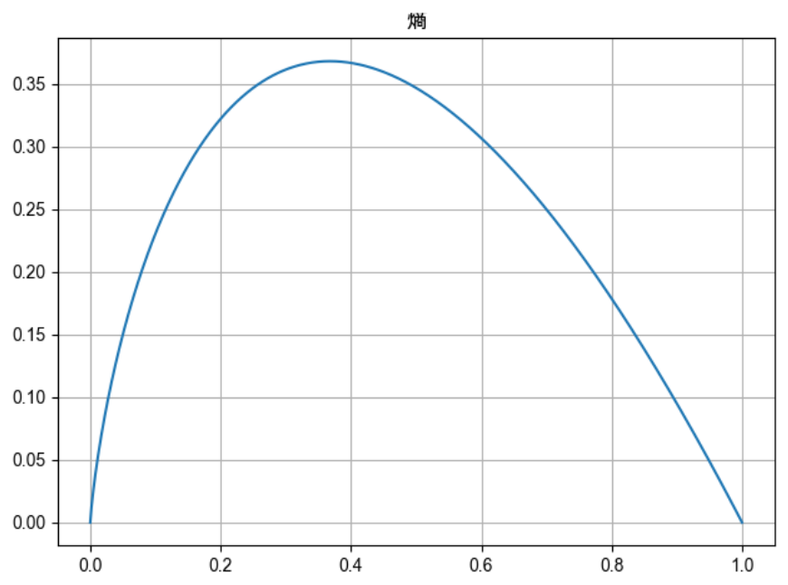

$$\sum_{i=0}^N\int_{a}^{b}g(t,i)\text{d}t$$
# 信息论-熵
## 熵是什么
熵又称为自信息，描述随机变量的不确定性的数量。熵越大，表示不确定性越大，
> $$H(x) = -\sum_{x\in R}p(x)*logp(x)$$   
> 约定： $$0*log0=0$$   

## 联合熵和条件熵
联合熵：
$$H(X,Y) = -\sum_{x \in X}\sum_{y \in Y}p(x,y)*log(x,y)$$

条件熵：
$$H(Y|X) = \sum_{x \in X}H(Y|X=x)$$

其中有熵的连锁规则：
$$H(X,Y) = H(X) + H(Y|X) = H(Y)+H(X|Y)$$

定义互信息,反应知道Y值后X不确定性的减少量：
$$I(X;Y) = H(X) - H(X|Y)$$
## 相对熵
相对熵又称KL散度，衡量两个概率分布的差距
> $$D(p||q) = \sum_{x \in X} p(x)log\frac{p(x)}{q(x)} = E_{p}(log\frac{p(X)}{p(Y)})$$

其中互信息实际上是衡量一个联合分布同独立性差异的度量(可证明)
> $$ I(X;Y) = D(p(x,y)||p(x)p(y))$$

## 交叉熵
衡量估计模型同真实概率分布之间的差异。   
注意这里有几个点：随机变量X-真实分布p-近似分布q
> $$H(X,q) = H(X) + D(p||q)=-\sum_{x\in R}p(x)*logp(x) + \sum_{x \in X} p(x)log\frac{p(x)}{q(x)} = -\sum p*log q$$

